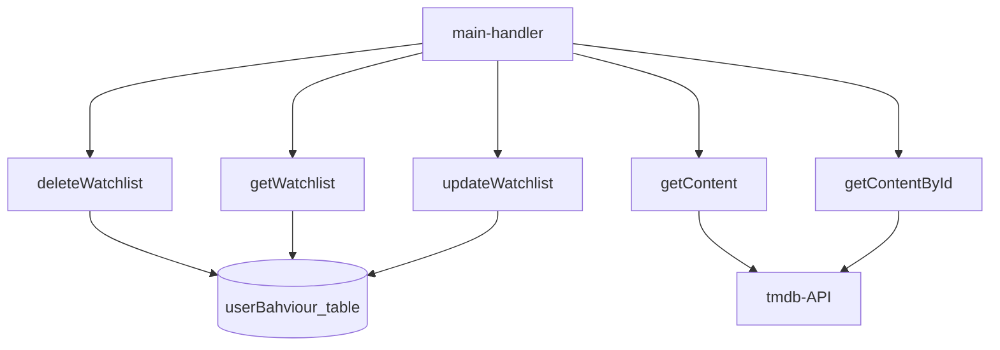

# :warning: Warning

The project is not supplied with .env files   
so if you wish to run this yourself, you will  
need to create some yourselves

# Here is a simple flow chart:

# Tech Stack

node version: 20.7.0  
npm version: 10.1.0  

for more information read the pacakge.json file